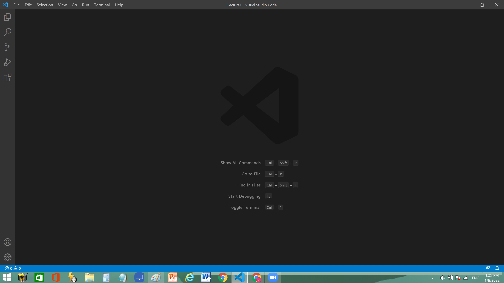
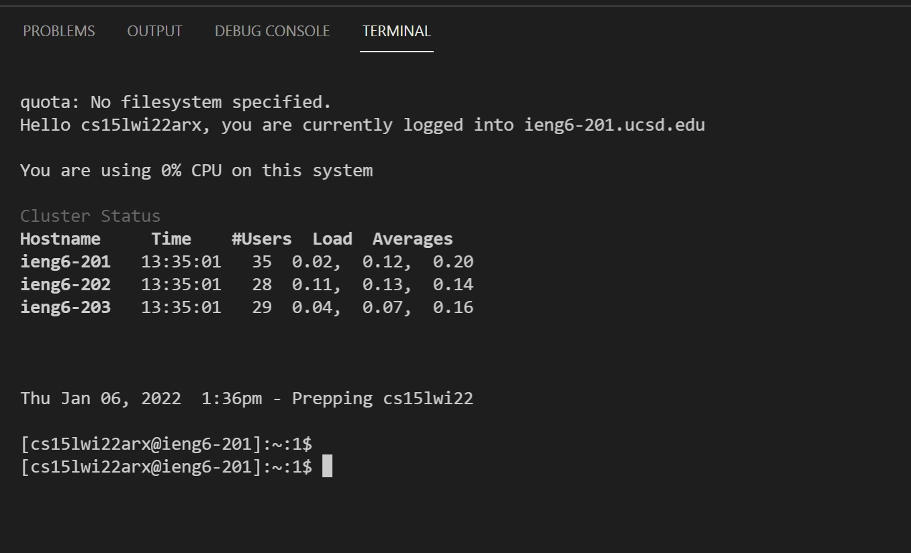
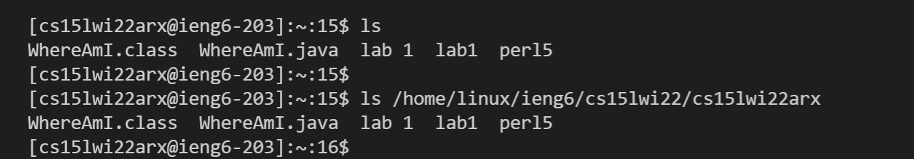
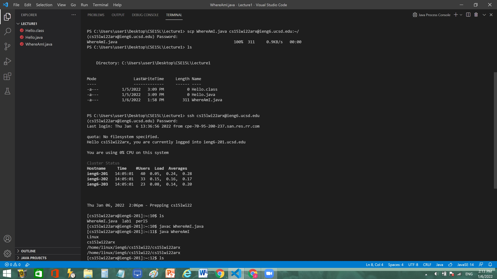
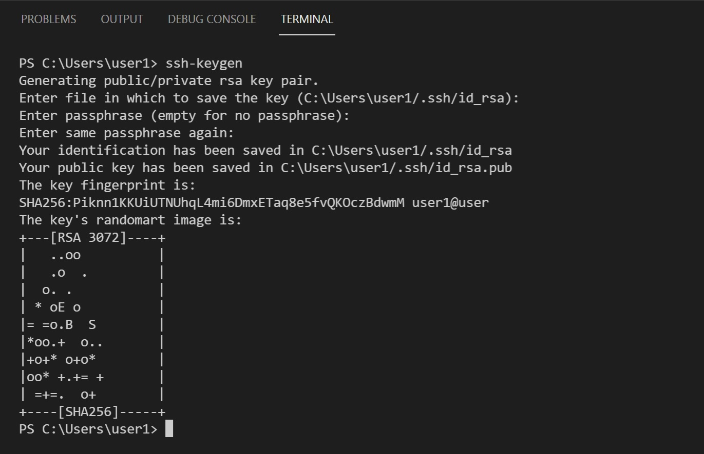

# **Lab Report 1 : Remote Access**

**Part 1 - Istalling Visual Studio Code**

Go to: [Visual Studio Code Webstite](https://code.visualstudio.com/)

Depending on your computer's operating system, download the appropriate version of the vs code and install it on your computer.

After the installation, open up a new window of VS code. It should look something like this.
(The color of the window might be differnet due to different setting.)



**Part 2 - Remote Connections**

This part requires a course-specific account.
To find your CSE 15L account, go to [UCSD Account Lookup](https://sdacs.ucsd.edu/~icc/index.php)
and look for an account that starts with cs15ll.

In order to use this account, it needs to be activated by changing the password. (It could take up to 30 minutes for the passworde change to be finalized.)

While waiting for the password changed to be finalized, install OpenSSH using the link below:

[OpenSSH](https://docs.microsoft.com/en-us/windows-server/administration/openssh/openssh_install_firstuse)

After installing the OpenSSH, open a new terminal inside of VS Code.
Using the following command line, login to the remote server using the password set during the account activation.

`ssh cs15lwi22zz@ieng6.ucsd.edu`
<br />(replace zz with your specific id characters)

If you have successfully logged in, the screen wil look like the following:



**Part 3 - Trying Some Commands**



Using the following commands, check some features of the remote server.
<br />`cd` : shows current directory
<br />`ls` : list files and directories of the current directory
<br />`mkdir` : make new directory
<br />`exit` : log out of the remote server

**Part 4 - Moving Files with scp**

On the client server, create a new file named `WhereAmI.java`
Copy the following codes into the file:

```
class WhereAmI {
  public static void main(String[] args) {
    System.out.println(System.getProperty("os.name"));
    System.out.println(System.getProperty("user.name"));
    System.out.println(System.getProperty("user.home"));
    System.out.println(System.getProperty("user.dir"));
  }
}
```
Make sure the codes compile and execute using `javac` and `java` on the cient server.
Then using the following command (replace zz with your username):

`scp WhereAmI.java cs15lwi22zz@ieng6.ucsd.edu:~/`

Copy the file to the remote server. (Logging in with the password is required.)

Rerun the file on the remote server, and the output should be different from the output when the file was ran on the client server.

<br />

**Part 5 - SSH Keys**



Instead of typing in the password everytime you try to log in to the remote server, `ssh` keys can be used.
A program called `ssh-keygen` generates one public key and one secret key. Copy the public key on the remote server and the private key on the client server. This allows the `ssh` command to use the generated keys instead of the password.

**Part 6 - Optimizing Remote Running**

Previous command lines can be accessed using the upper arrow key.


                                                            
                                                
