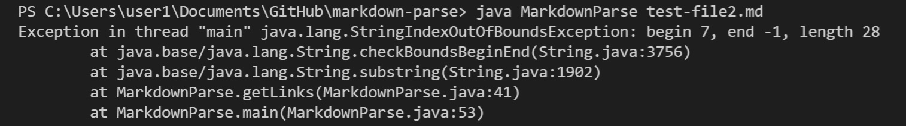
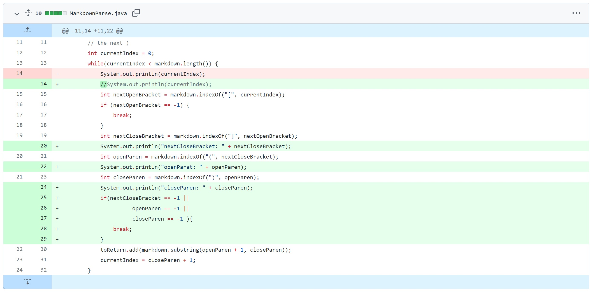
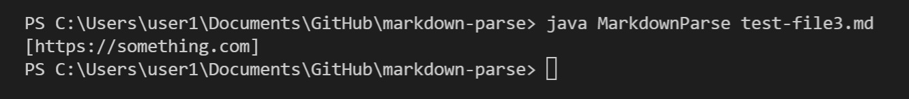
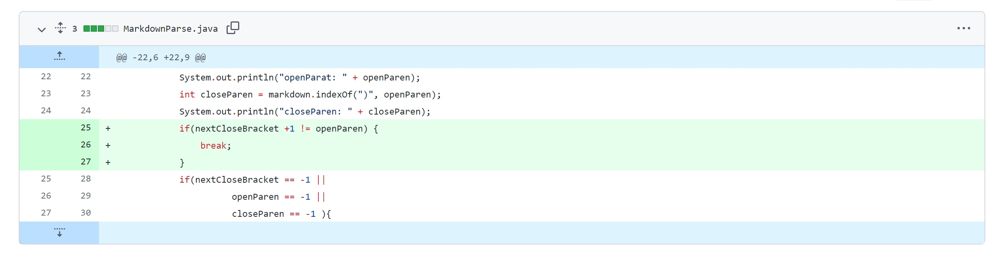
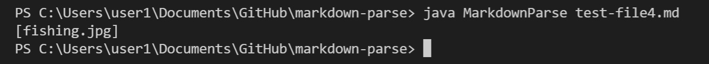
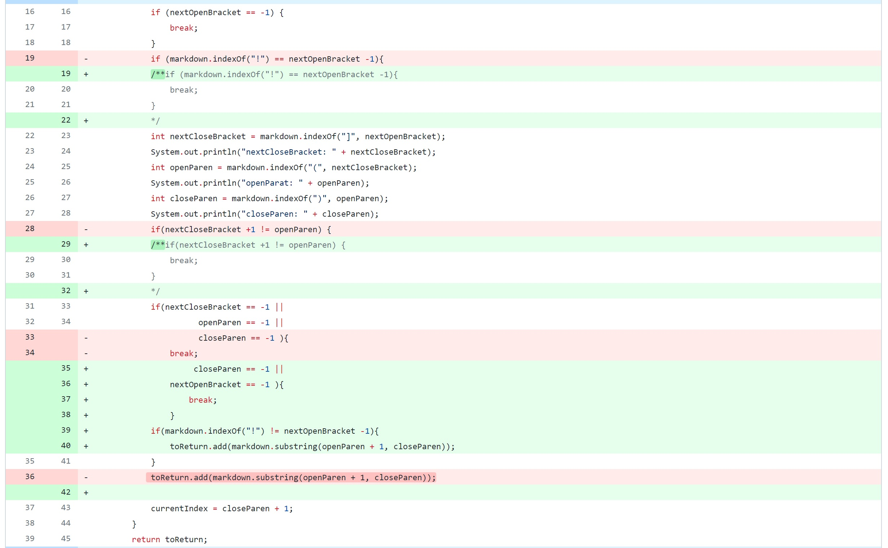

**1st fix:**

[input : test-file2](https://github.com/eunkjm/markdown-parse/blob/main/test-file2.md)

When the input text file contianed a link that misses any of the OpenBracket, ClosedBracket, OpenParenthesis and ClosedParenthesis, IndexOutofBound exception occurred. By implementing if statement that checks whether the four exist or not, we fixed the bug so the code would break the while loop if any of them are missing. Then, an empty list "[]" is printed as the output.

**2nd fix:**

[input: test-file3](https://github.com/eunkjm/markdown-parse/blob/main/test-file3.md)

Before the fix, the code didn't recognize an invalid format of the url and printed it out in the list.
We implimented if statement to check if the ClosedBracket and the OpenParenthesis are next to each other. If not, the while loop breaks and an empty list "[]" is printed as the output.

**3rd fix**

[input : test-file4](https://github.com/eunkjm/markdown-parse/blob/main/test-file4.md)

Image and the link have the similar formats; they both involve OpenBracket, ClosedBracket, OpenParenthesis and ClosedParenthesis which are what our code checks. As the result, there was a bug where image was not differentiated from the link and was printed out in the list as the url. We fixed the bug by implementing if statement that checks the placement of "!". If "!" was found, the corresponding image input is not printed in the list as the output.
