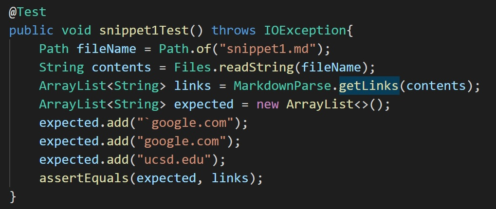
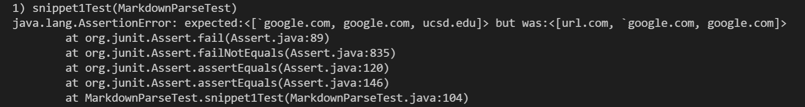
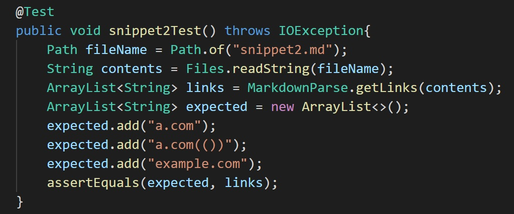
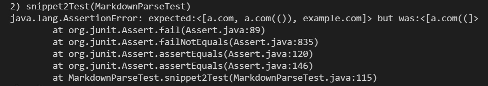
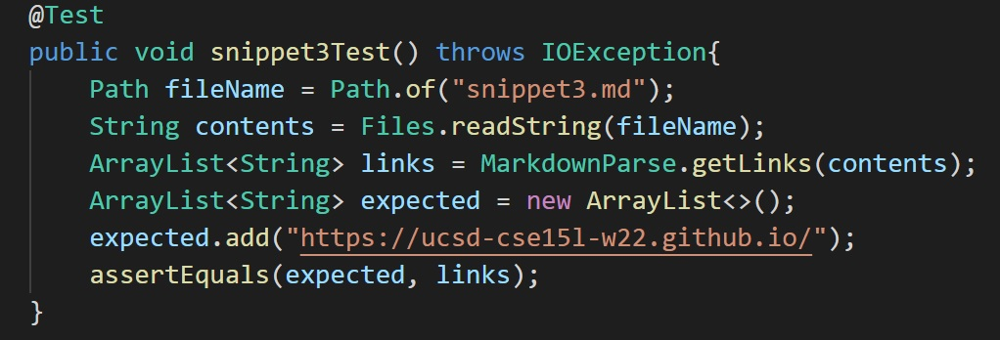
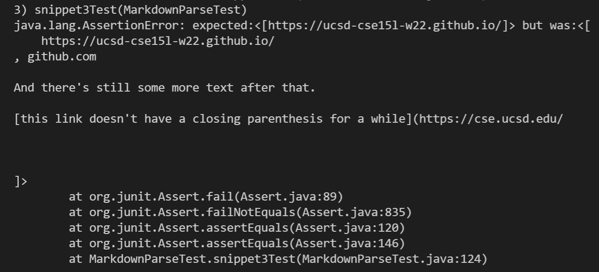

[My markdown-parse repository](https://github.com/eunkjm/CSE15L-RoseateSpoonbill)\ 
[Reviewed markdown-parse repository](https://github.com/Shree-G/markdown-parse)

# snippet 1
According to the [CommonMark demo site](https://spec.commonmark.org/dingus/), 
```[another link](`google.com)`
   [`cod[e`](google.com)
   [`code]`](ucsd.edu) ```

are considered as links.

**Test implemented in my markdown-parse:**



# snippet 2
According to the CommonMark demo site,
```[nested link](a.com)
   [a nested parenthesized url](a.com(()))
   [some escaped \[ brackets \]](example.com) ```

are considered as links.

**Test implemented in my markdown-parse:**



# snippet 3
According to the CommonMark demo site, only
`[this title text is really long and takes up more than 
one line](
    https://ucsd-cse15l-w22.github.io/
)`
is considered as a link

**Test implemented in my markdown-parse:**




