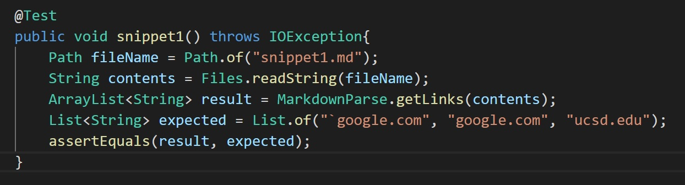
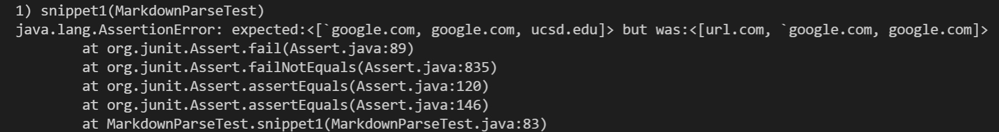
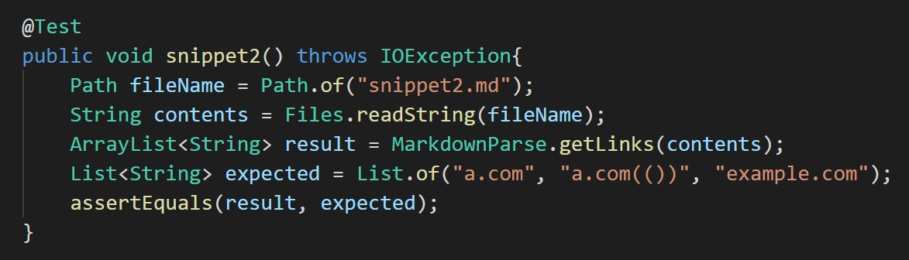
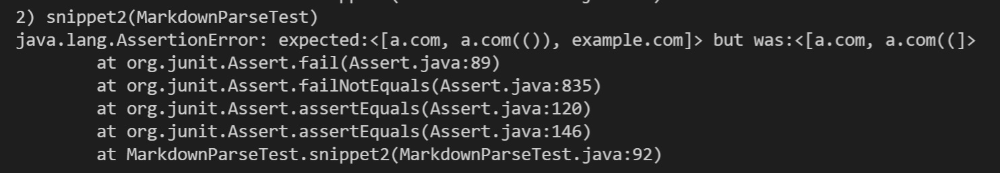
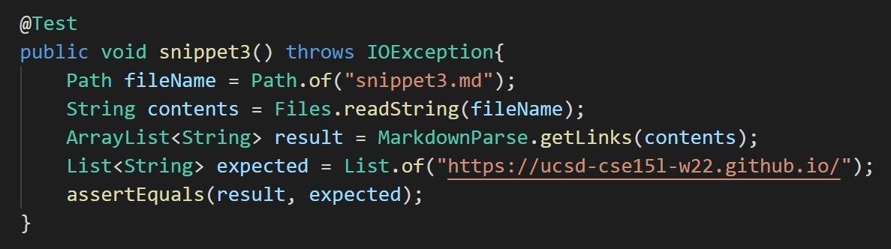
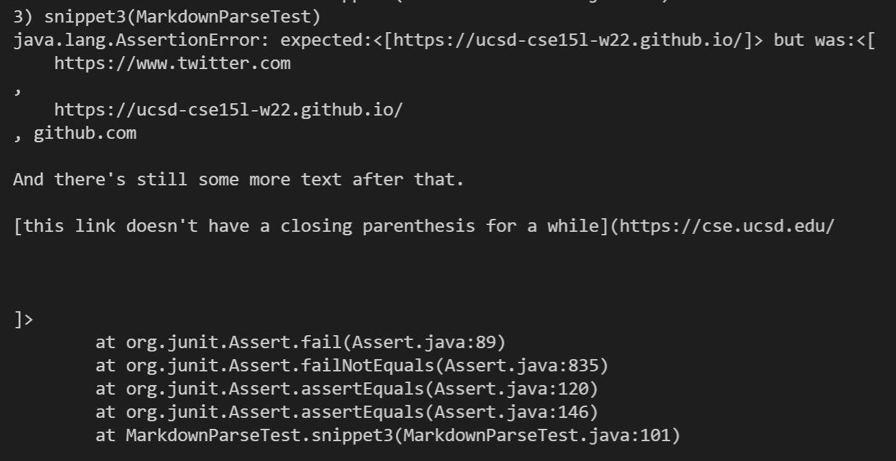

[My markdown-parse repository](https://github.com/eunkjm/CSE15L-RoseateSpoonbill)
 [Reviewed repository](https://github.com/Shree-G/markdown-parse)

# snippet 1
According to the [CommonMark demo site](https://spec.commonmark.org/dingus/), 
 `[another link](`google.com)`, [`cod[e`](google.com), [`code]`](ucsd.edu)``
 are considered as links.

**Test implemented in my markdown-parse:**

**In the reviewed repository:**

# snippet 2
According to the CommonMark demo site,
 `[nested link](a.com), [a nested parenthesized url](a.com(())), [some escaped \[ brackets \]](example.com)`
 are considered as links.

**Test implemented in my markdown-parse:**

**In the reviewed repository:**

# snippet 3
According to the CommonMark demo site, only
 `[this title text is really long and takes up more than 
one line](
    https://ucsd-cse15l-w22.github.io/
)`
 is considered as a link

**Test implemented in my markdown-parse:**

**In the reviewed repository:**

