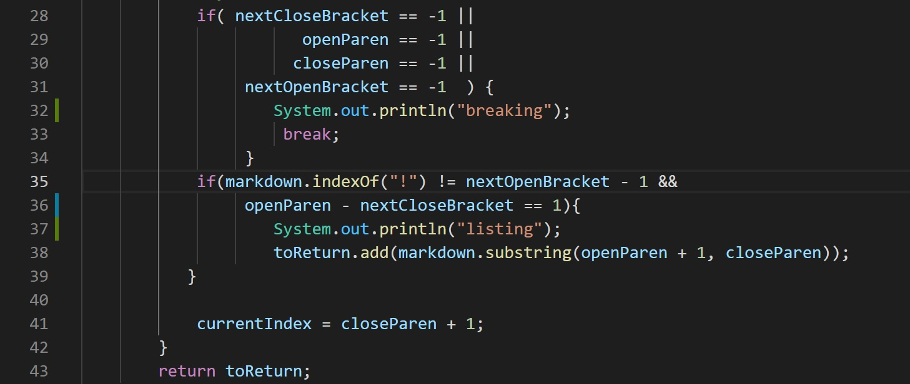
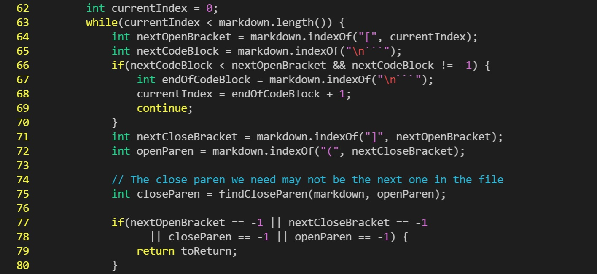

# Different Results

Using the diff command, I compared and contrasted the two url lists:

After looking through the output, I chose 495.md and 577.md for the evaluation.

## 495.md
According to the [CommonMark demo site](https://spec.commonmark.org/dingus/), the expected output for 495.md is `[foo(and(bar))]`

The provided markdown-parse had the correct output while my MarkdownParse implementation returned an empty list.

**Bug:**

I found out that my implementatation returned the empty list as an output because it didn't reach line 40.
The index of the first OpenBracekt was 0 and the index of '!' was -1 since it wasn't found in the file. One of the conditions for if statement in line 37 specified that the index of '!' shouldn't equal 0 - 1 = -1, hence the output was `[]` as the url was not added to the list.
However, the output would still not be correct even if the if conditions were fixed. (I found this bug by putting a space infront of the first open bracket and making the index of it not 0.) For my current implementation, the while loop will break after the first close parenthesis is reached because next open braket can't be found (line 28) and the output will be: `[foo(and(bar]` There should be a code fix in line 35 to determine if the last charactor of the url is ')', so all the string that comes beforehand can be included in the url list.

## 577.md

Since the format of the file was an image, the expected out is an empty list, `[]`

This time, my MarkdownParse returned the correct output while the provided markdown-parse failed to differentiate an image format from a link format.

**Bug**

The bug of the provided markdown-parse was that it didn't check for the placement of '!' infront of the first open bracket.
In line 77, the if conditions should be fixed so it also checks whether or not the index of '!' is not equal to -1, so the image url will not be added to the url list.
