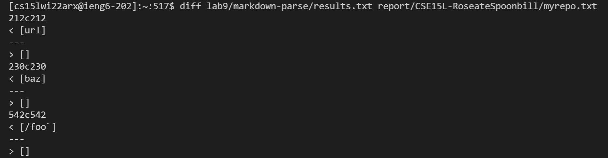
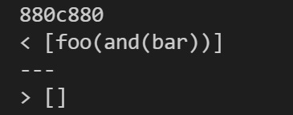

# Different Results

Using the diff command, I compared and contrasted the two url lists:

After looking through the output, I chose 495.md and 577.md for the evaluation.

## 495.md
According to the [CommonMark demo site](https://spec.commonmark.org/dingus/), the expected output for 495.md is `[foo(and(bar))]`

The provided markdown-parse had the correct output while my MarkdownParse implementation returned an empty list.

## 577.md

Since the format of the file was an image, the expected out is an empty list, `[]`

This time, my MarkdownParse returned the correct output while the provided markdown-parse failed to differentiate an image format from a link format.
